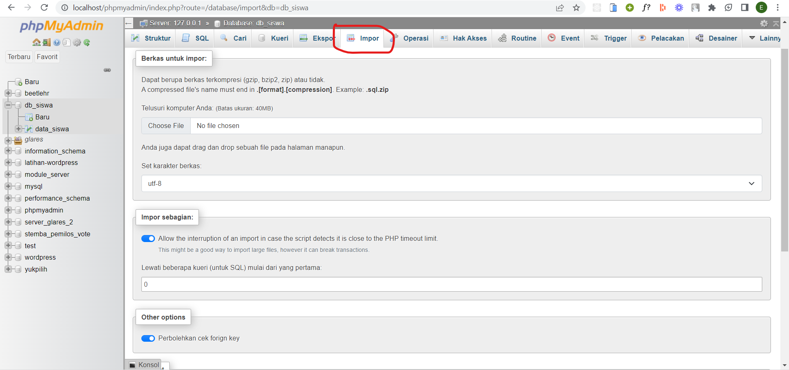
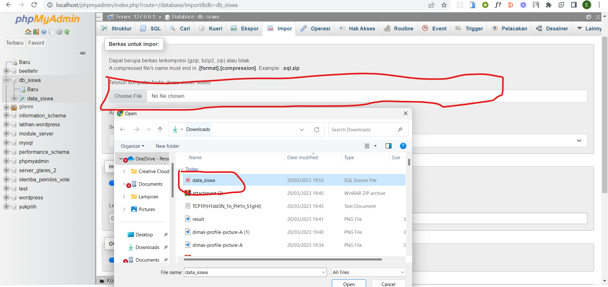
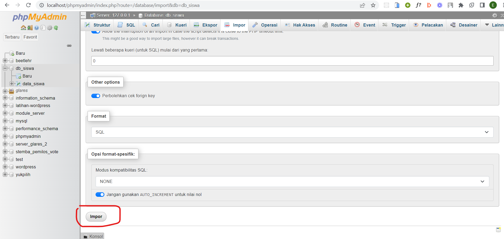

Import file sql ke database dengan cara. Buka php my admin di http://localhost/phpmyadmin.

Pergi ke menu impor pada phpmyadmin

Tekan pada tombol input file dan pilih file sql pada folder ini

Tekan impor pada bagian paling bawah halaman

